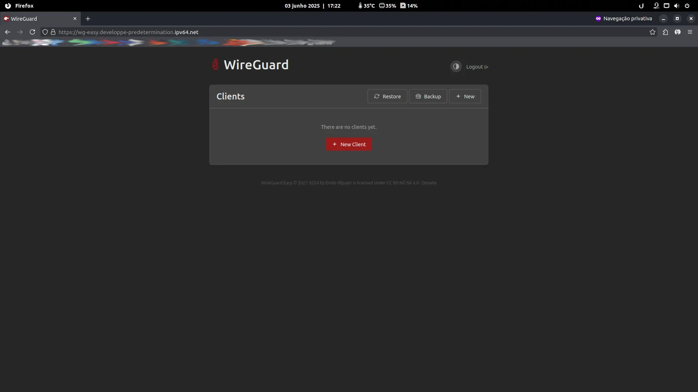

<h2> Ansible playbooks to setup a self-hosted WireGuard VPN server </h2>

<p align="center">
    
    
    
</p>



This repo is forked from [rishavnandi/ansible_selfhost_vpn](https://github.com/rishavnandi/ansible_selfhost_vpn) and contains Ansible playbooks to setup a self-hosted WireGuard VPN server with my modifications. Originally based on [wg-easy](https://github.com/WeeJeWel/wg-easy) which provides a nice web interface to add and remove clients.

## ⚠️ Support

> [!NOTE]
>**Only** the OS's below have been tested for use with this script.

|     OS     |   Support   |
| ---------- | ----------- |
| Debian     |     Yes     |
| Ubuntu     |     Yes     |
| RHEL       |     Yes     |
| AlmaLinux  |     Yes     |
| RockyLinux |     Yes     |


## 🚀 Usage

- Clone the repo:

```bash
git clone https://github.com/ciro-mota/ansible_selfhost_vpn.git && cd "$(basename "$_" .git)
```
- The password to access `wg-easy` needs to be encrypted in `Bcrypt` format. Run the command below to generate it and save it with Ansible Vault.

```bash
ansible-vault encrypt_string $(htpasswd -nbBC 12 "" your-password-here | cut -d ':' -f2) --name 'wg_password' >> roles/wireguard/vars/main.yml
```

- Create a file `vault-pass` with the password you set in the previous step in Ansible Vault in your `/home` directory.

- Enter the instance IP address in the `hosts_vars/wg` file in the line `1`.

- You will need to generate SSH keys and configure them with your cloud provider where you will provision the WireGuard.

- Set your `private key` on the `hosts_vars/wg` file in the line `2`.

> [!TIP]
>If using with Oracle, uncomment the line `4` in the `hosts_vars/wg` file.

- It is necessary to install the `community.docker` module for it to work, run the command below to install it on your system.

```bash
ansible-galaxy collection install community.docker
```

- Then simply run the Ansible playbook.

```bash
ansible-playbook -i hosts run.yml --vault-password-file ~/vault-pass
```
- Finally you can visit the `wg-easy` at your server's IP address on port `51821` to configure your WireGuard devices.


## 🔓 Extras

This script also installs the [Nginx Proxy Manager](https://nginxproxymanager.com/guide/) and you can also configure for you can access your services over the internet using a domain name. You should access it through your server's IP address on port `81`.

On your first access you must access it with the credentials below:

```
Email:    admin@example.com
Password: changeme
```

You can obtain a free domain name from [DuckDNS](https://www.duckdns.org/) or [IPv64](https://ipv64.net/) or any other service of your preference to use with Nginx Proxy Manager, also you can use a domain name if you already own. Make sure the domain name is pointing to your server's public IP address. [See how](https://www.youtube.com/watch?v=qlcVx-k-02E).

> [!TIP]
>The command below can generate interesting names for your domain/homelab.

```bash
shuf /usr/share/dict/words | head -2 | tr "\n" " "; echo
```

## 📌 Tested on


