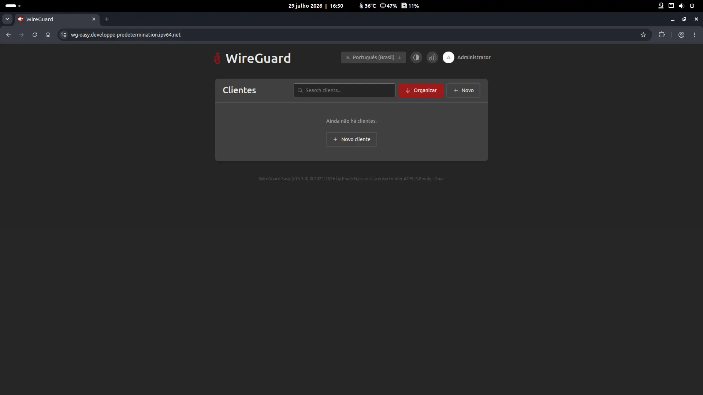

<h2> Ansible playbooks to setup a self-hosted WireGuard VPN server </h2>

<p align="center">
    
    
    
</p>



This repo is forked from [rishavnandi/ansible_selfhost_vpn](https://github.com/rishavnandi/ansible_selfhost_vpn) and contains Ansible playbooks to setup a up to date self-hosted WireGuard VPN server with some modifications. Originally based on [wg-easy](https://github.com/WeeJeWel/wg-easy) which provides a nice web interface to add and remove clients.

## ⚠️ Support

> [!NOTE]
>**Only** the OS's below have been tested for use with this script.

|     OS     |   Support   |
| ---------- | ----------- |
| Debian     |     Yes     |
| Ubuntu     |     Yes     |
| RHEL       |     Yes     |
| AlmaLinux  |     Yes     |
| RockyLinux |     Yes     |


## 🚀 Usage

- Clone the repo:

```bash
git clone https://github.com/ciro-mota/ansible_selfhost_vpn.git && cd "$(basename "$_" .git)
```

- Enter the instance IP address in the `hosts_vars/wg.yml` file in the line `1`.

- You will need to generate SSH keys and configure them with your cloud provider where you will provision the WireGuard.

- Set your `private key` on the `hosts_vars/wg.yml` file in the line `2`.

> [!NOTE]
>Replace `ansible_user` for your instance: `admin` for AWS, or `oci` or `ubuntu` for Oracle and uncomment the line `4` in the `hosts_vars/wg.yml` file for that.

- It is necessary to install the `community.docker` module for it to work, run the command below to install it on your system.

```bash
ansible-galaxy collection install community.docker
```

- Then simply run the Ansible playbook.

```bash
ansible-playbook -i inventory.yml run.yml
```

## 🔓 Access

This script also automatically installs the [Caddy](https://caddyserver.com/) and you can also configure the `caddy/files/Caddyfile` for you can access your services over the internet using a domain name.

You can obtain a free domain name from [DuckDNS](https://www.duckdns.org/) or [IPv64](https://ipv64.net/) or any other service of your preference, also you can use a domain name if you already own.

> [!TIP]
>The command below can generate interesting names for your domain/homelab.

```bash
shuf /usr/share/dict/words | head -2 | tr "\n" " "; echo
```

Access it via the URL you configured in the `Caddyfile`. Upon your first login you will need to register your access credentials.

## 📌 Tested on


